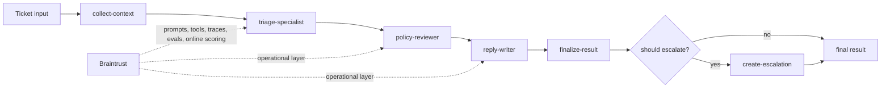

# Shipping Quality AI Applications with Braintrust

Checkpoint: `05-add-dataset-and-evals`

This branch adds a seeded eval dataset and offline Braintrust experiments around the traced staged workflow. Each eval row runs one full support ticket end to end, then scores the final result with deterministic exact-match checks plus a small reply rubric.

## What exists here

- local help-center search in `src/tools.ts`
- local account-event lookup in `src/tools.ts`
- deterministic escalation creation in `src/tools.ts`
- explicit workflow stages under `src/workflow/`
- Braintrust tracing helpers in `src/braintrust/tracing.ts`
- traced app orchestration in `src/app.ts`
- consistent root/stage/tool metadata and tags across the local runtime path
- seeded dataset rows in `data/evals.seed.jsonl`
- dataset upload in `src/braintrust/dataset.ts` and `scripts/seed-dataset.ts`
- offline eval runner in `src/braintrust/evals.ts`
- deterministic scorers in `src/braintrust/scorers.ts`
- demo and ticket scripts that create root traces and show context, stage outputs, and escalation

## What is intentionally missing

- no managed prompts, managed tools, managed parameters, or online scoring

## Run

```bash
make setup
make demo
make seed-dataset
make eval
make ticket
```

`make demo` and `make ticket` still work with only `OPENAI_API_KEY`.

If you also set `BRAINTRUST_API_KEY` and `BRAINTRUST_PROJECT`:
- `make demo` and `make ticket` emit root, stage, and tool traces to Braintrust
- `make seed-dataset` uploads `Helpr Seed Dataset`
- `make eval` logs a Braintrust experiment for the full staged run

Without Braintrust configured:
- `make eval` falls back to a local score summary instead of creating a remote experiment

## Pseudocode

```ts
for (row of seedDataset) {
  output = runSupportTriage(row.input);
  scores = scoreFinalResult(output, row.expected);
  logExperimentRow({ input: row.input, output, scores });
}
```

## Target architecture

This workshop builds toward a bounded staged agent for support triage.
Early checkpoints only implement part of this flow; later checkpoints fill in the full path.



The intended mental model is:

- deterministic context and business logic stay explicit
- model stages make bounded decisions rather than running an open-ended agent loop
- Braintrust becomes the operational layer around prompts, tools, traces, evals, and live scoring

## Next checkpoint

Move to `06-managed-prompts-and-parameters` to move prompt/runtime configuration into Braintrust.
