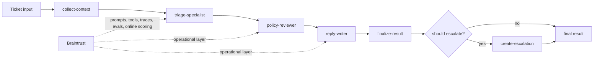

# Shipping Quality AI Applications with Braintrust

Checkpoint: `04-add-tracing`

This branch adds Braintrust tracing around the staged workflow. Root runs, workflow stages, local retrieval tools, and deterministic escalation creation now appear as nested spans, and each span carries consistent metadata and Braintrust tags so the agent flow is inspectable and easy to filter in the UI.

## What exists here

- local help-center search in `src/tools.ts`
- local account-event lookup in `src/tools.ts`
- deterministic escalation creation in `src/tools.ts`
- explicit workflow stages under `src/workflow/`
- Braintrust tracing helpers in `src/braintrust/tracing.ts`
- traced app orchestration in `src/app.ts`
- consistent root/stage/tool metadata and tags across the local runtime path
- demo and ticket scripts that create root traces and show context, stage outputs, and escalation

## What is intentionally missing

- no datasets, evals, managed prompts, managed tools, or online scoring

## Run

```bash
make setup
make demo
make ticket
```

If you only set `OPENAI_API_KEY`, the commands still run and print local output.

If you also set `BRAINTRUST_API_KEY` and `BRAINTRUST_PROJECT`, the same commands emit root, stage, and tool traces to Braintrust so you can inspect the workflow in the UI.

## Pseudocode

```ts
runSupportTriage(input) {
  return withTrace("support-triage", input, async (rootSpan) => {
    context = withChildSpan(rootSpan, "collect-context", () => collectContext(input));
    draft = withChildSpan(rootSpan, "triage-specialist", () => runTriageSpecialist(input, context));
    reviewed = withChildSpan(rootSpan, "policy-reviewer", () => runPolicyReviewer(input, context, draft));
    reply = withChildSpan(rootSpan, "reply-writer", () => runReplyWriter(input, reviewed));
    return withChildSpan(rootSpan, "finalize-result", () => finalizeResult(reviewed, reply));
  });
}
```

## Target architecture

This workshop builds toward a bounded staged agent for support triage.
Early checkpoints only implement part of this flow; later checkpoints fill in the full path.



The intended mental model is:

- deterministic context and business logic stay explicit
- model stages make bounded decisions rather than running an open-ended agent loop
- Braintrust becomes the operational layer around prompts, tools, traces, evals, and live scoring

## Next checkpoint

Move to `05-add-dataset-and-evals` to start scoring complete ticket runs against seeded examples.
