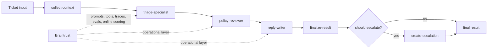

# Shipping Quality AI Applications with Braintrust

Checkpoint: `03-specialist-stages`

This branch refactors Helpr into a staged workflow. Context collection, triage drafting, policy review, reply writing, and deterministic finalization are now explicit, and the finalization stage is responsible for creating the escalation record when required.

## What exists here

- local help-center search in `src/tools.ts`
- local account-event lookup in `src/tools.ts`
- deterministic escalation creation in `src/tools.ts`
- explicit workflow stages under `src/workflow/`
- app orchestration in `src/app.ts`
- demo and ticket scripts that show context, stage outputs, and escalation

## What is intentionally missing

- no staged specialist workflow
- no Braintrust tracing, datasets, evals, or managed objects

## Run

```bash
make setup
make demo
make ticket
```

## Pseudocode

```ts
runSupportTriage(input) {
  context = collectContext(input);
  draft = runTriageSpecialist(input, context);
  reviewed = runPolicyReviewer(input, context, draft);
  reply = runReplyWriter(input, reviewed);
  return finalizeResult(reviewed, reply);
}
```

## Target architecture

This workshop builds toward a bounded staged agent for support triage.
Early checkpoints only implement part of this flow; later checkpoints fill in the full path.



The intended mental model is:

- deterministic context and business logic stay explicit
- model stages make bounded decisions rather than running an open-ended agent loop
- Braintrust becomes the operational layer around prompts, tools, traces, evals, and live scoring

## Next checkpoint

Move to `04-add-tracing` to make the staged execution path visible in Braintrust.
