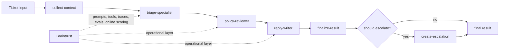

# Shipping Quality AI Applications with Braintrust

Checkpoint: `02-add-local-tools`

This branch adds deterministic local tools to the first runnable agent. The model still makes one structured decision, but it now sees retrieved context and the app can trigger a deterministic escalation record when the ticket should be escalated.

## What exists here

- local help-center search in `src/tools.ts`
- local account-event lookup in `src/tools.ts`
- deterministic escalation creation in `src/tools.ts`
- one-pass support triage flow with deterministic context in `src/app.ts`
- demo and ticket scripts that show context and escalation

## What is intentionally missing

- no staged specialist workflow
- no Braintrust tracing, datasets, evals, or managed objects

## Run

```bash
make setup
make demo
make ticket
```

## Pseudocode

```ts
runSupportTriage(input) {
  context = collectLocalContext(input);
  result = model(buildPrompt(input, context)).asStructuredJson();
  escalation = result.should_escalate ? createEscalation(result.escalation_reason) : null;
  return { result, context, escalation };
}
```

## Target architecture

This workshop builds toward a bounded staged agent for support triage.
Early checkpoints only implement part of this flow; later checkpoints fill in the full path.



The intended mental model is:

- deterministic context and business logic stay explicit
- model stages make bounded decisions rather than running an open-ended agent loop
- Braintrust becomes the operational layer around prompts, tools, traces, evals, and live scoring

## Next checkpoint

Move to `03-specialist-stages` to split the single decision into explicit AI stages.
