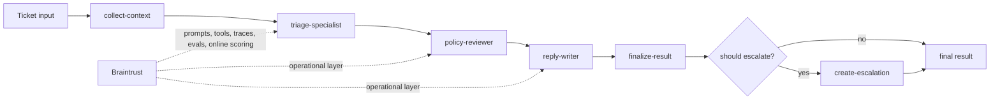

# Shipping Quality AI Applications with Braintrust

Checkpoint: `01-basic-agent`

This branch adds the first runnable version of Helpr: one prompt in, one structured triage result out. It is deliberately local-only and keeps the workflow to a single model call so attendees can understand the prototype before tools, stages, and Braintrust enter the picture.

## What exists here

- one-pass support triage flow in `src/app.ts`
- shared input and output schemas in `src/schemas.ts`
- local prompt construction in `src/prompts.ts`
- a demo runner and interactive ticket CLI

## What is intentionally missing

- no deterministic tools
- no staged specialist workflow
- no Braintrust tracing, datasets, evals, or managed objects

## Run

```bash
make setup
make demo
make ticket
```

## Pseudocode

```ts
runSupportTriage(input) {
  prompt = buildPrompt(input);
  return model(prompt).asStructuredJson();
}
```

## Target architecture

This workshop builds toward a bounded staged agent for support triage.
Early checkpoints only implement part of this flow; later checkpoints fill in the full path.



The intended mental model is:

- deterministic context and business logic stay explicit
- model stages make bounded decisions rather than running an open-ended agent loop
- Braintrust becomes the operational layer around prompts, tools, traces, evals, and live scoring

## Next checkpoint

Move to `02-add-local-tools` to add deterministic context before the model decides.
