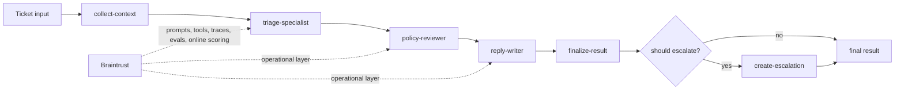

# Shipping Quality AI Applications with Braintrust

Checkpoint: `00-starter`

This branch is the workshop scaffold only. It gives attendees a clean starting point with the same developer ergonomics the later checkpoints use, without introducing the support-triage app yet.

## What exists here

- `mise` and `pnpm` tool setup
- a minimal `Makefile`
- TypeScript project scaffolding
- environment example for local and managed runtime modes

## What is intentionally missing

- no ticket triage flow
- no OpenAI integration
- no Braintrust runtime
- no demo, eval, or replay scripts yet

## Run

```bash
make setup
```

## Pseudocode

```ts
main() {
  loadToolingConfig();
  printWorkshopNextSteps();
}
```

## Target architecture

This workshop builds toward a bounded staged agent for support triage.
Early checkpoints only implement part of this flow; later checkpoints fill in the full path.



The intended mental model is:

- deterministic context and business logic stay explicit
- model stages make bounded decisions rather than running an open-ended agent loop
- Braintrust becomes the operational layer around prompts, tools, traces, evals, and live scoring

## Next checkpoint

Move to `01-basic-agent` to add the first runnable structured triage flow.
