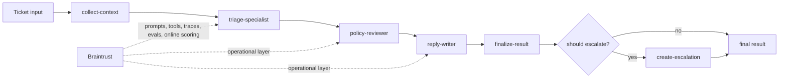

# Shipping Quality AI Applications with Braintrust

Checkpoint: `06-managed-prompts-and-parameters`

This branch moves prompt and runtime-model configuration into Braintrust while keeping the local tools and offline eval flow intact. The staged workflow can now run in either `RUNTIME_MODE=local` or `RUNTIME_MODE=managed`.

## What exists here

- local help-center search in `src/tools.ts`
- local account-event lookup in `src/tools.ts`
- deterministic escalation creation in `src/tools.ts`
- explicit workflow stages under `src/workflow/`
- Braintrust tracing helpers in `src/braintrust/tracing.ts`
- traced app orchestration in `src/app.ts`
- consistent root/stage/tool metadata and tags across the runtime path
- seeded dataset rows in `data/evals.seed.jsonl`
- dataset upload in `src/braintrust/dataset.ts` and `scripts/seed-dataset.ts`
- offline eval runner in `src/braintrust/evals.ts`
- deterministic scorers in `src/braintrust/scorers.ts`
- Braintrust prompt bootstrap in `src/braintrust/prompts.ts`
- Braintrust runtime parameter bootstrap/loading in `src/braintrust/parameters.ts`
- Braintrust setup entrypoint in `scripts/setup-braintrust.ts`
- managed runtime path in `src/app.ts` and `src/workflow/`
- demo and ticket scripts that create root traces and show context, stage outputs, and escalation

## What is intentionally missing

- no managed tools, remote scorers, or online scoring

## Run

```bash
make setup
make setup-braintrust
make demo
make seed-dataset
make eval
make ticket
RUNTIME_MODE=managed make demo
```

`make demo` and `make ticket` still work with only `OPENAI_API_KEY`.

If you also set `BRAINTRUST_API_KEY` and `BRAINTRUST_PROJECT`:
- `make demo` and `make ticket` emit root, stage, and tool traces to Braintrust
- `make seed-dataset` uploads `Helpr Seed Dataset`
- `make eval` logs a Braintrust experiment for the full staged run

To run the managed path in this phase:
- run `make setup-braintrust` once to publish the three prompt slugs and `helpr-runtime-config`
- then run `RUNTIME_MODE=managed make demo`

If you change prompt or parameter definitions in code and want to refresh the remote objects, use:

```bash
BRAINTRUST_IF_EXISTS=replace make setup-braintrust
```

Without Braintrust configured:
- `make eval` falls back to a local score summary instead of creating a remote experiment

## Pseudocode

```ts
setupBraintrust({
  prompts: ["helpr-triage-specialist", "helpr-policy-reviewer", "helpr-reply-writer"],
  parameters: ["helpr-runtime-config"],
});

runSupportTriage(input, {
  runtimeMode: "managed",
  model: loadParameters("helpr-runtime-config").model,
});

triagePrompt = loadPrompt("helpr-triage-specialist");
reviewPrompt = loadPrompt("helpr-policy-reviewer");
replyPrompt = loadPrompt("helpr-reply-writer");
```

## Target architecture

This workshop builds toward a bounded staged agent for support triage.
Early checkpoints only implement part of this flow; later checkpoints fill in the full path.



The intended mental model is:

- deterministic context and business logic stay explicit
- model stages make bounded decisions rather than running an open-ended agent loop
- Braintrust becomes the operational layer around prompts, tools, traces, evals, and live scoring

## Next checkpoint

Move to `07-managed-tools` to swap the local retrieval and escalation path for managed Braintrust tools.
