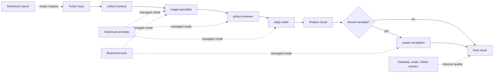
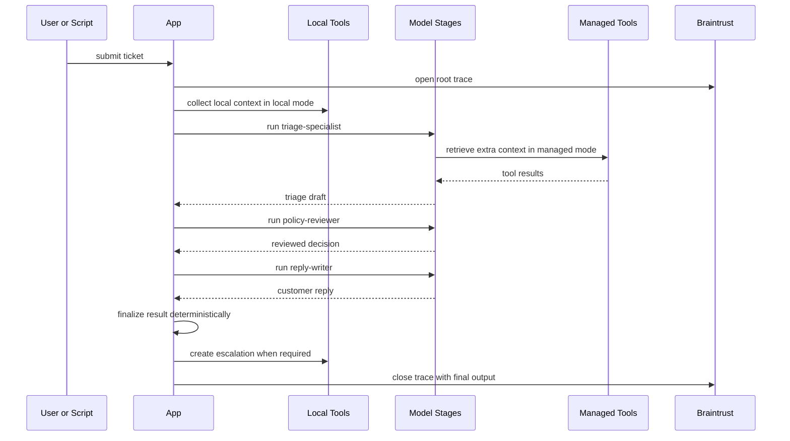

# Shipping Quality AI Applications with Braintrust

`Helpr` is a workshop reference app for a fictional B2B SaaS support triage system.
The repo demonstrates the operational loop around a staged AI workflow:

- collect deterministic context from tools
- run specialist model stages
- inspect nested traces in Braintrust
- seed datasets and run evals
- move prompt logic into Braintrust-managed prompts
- turn production-style failures into regression cases

## Prerequisites

- `mise`
- Braintrust account and API key
- OpenAI API key

## Setup

```bash
mise trust
mise install
make setup
```

Copy `.env.example` to `.env` and fill in the required values.

If you want to use Braintrust-managed prompts, remote scorers, and online scoring rules without manual setup in the UI:

```bash
make setup-braintrust
```

Recommended baseline for local verification:

```bash
RUNTIME_MODE=local make demo
RUNTIME_MODE=local make replay-failure
RUNTIME_MODE=local make eval
```

## Environment

Minimum variables:

```bash
OPENAI_API_KEY=
BRAINTRUST_API_KEY=
BRAINTRUST_PROJECT=helpr-workshop
BRAINTRUST_PROMPT_IF_EXISTS=ignore
RUNTIME_MODE=local
OPENAI_MODEL=gpt-5-mini
```

Core Braintrust objects use `BRAINTRUST_PROJECT` as the shared project name:
- traces
- managed prompts
- dataset upload
- eval experiments

The seed dataset name is fixed in code as `Helpr Seed Dataset`.

Eval experiments are uniquely named per run, using the pattern `helpr-seed-eval-<runtime-mode>-<utc-timestamp>`.

Managed prompt slugs are fixed in code:

- `helpr-triage-specialist`
- `helpr-policy-reviewer`
- `helpr-reply-writer`

Runtime-mode behavior:

- `RUNTIME_MODE=local`: every stage uses local prompt builders and local tool behavior in code.
- `RUNTIME_MODE=managed`: model stages use the repo-owned Braintrust prompt slugs, managed tools, and managed parameter loading in the configured project.
- `make setup-braintrust` creates the Braintrust project if needed and bootstraps the baseline prompt slugs, managed tools, managed parameter object, remote scorers, and online scoring rules used by the app.
- Managed mode fails fast if the required prompt slugs do not exist in the configured Braintrust project.
- Braintrust bootstrap is idempotent by default. Use `BRAINTRUST_IF_EXISTS=replace make setup-braintrust` when you explicitly want to refresh the remote prompts, scorers, and online rules from code.
- `helpr-runtime-config` is the managed runtime parameter object. Its active value is treated as UI-owned by default.
- `make setup-braintrust` preserves the active `helpr-runtime-config.model` value and uses it for prompt publication and LLM judge scorer publication.
- Managed prompts, tools, scorers, and parameters include descriptions plus structured metadata so cross-object relationships are easier to inspect in Braintrust UI.

## Commands

- `make setup-braintrust`
- `make demo`
- `make seed-dataset`
- `make eval`
- `make replay-failure`
- `make typecheck`

## Workshop flow

The initial delivery is backend-first:

1. submit a ticket from a script
2. print stage outputs and the final structured result in the terminal
3. inspect or edit the staged prompts in Braintrust
4. inspect the trace in Braintrust
5. use datasets and evals to iterate safely

If a UI is added later, keep it thin: ticket input, execution summary, final JSON, and a Braintrust trace link.

## Runtime shape

Each support request runs through these stages:

1. `collect-context`
2. `triage-specialist`
3. `policy-reviewer`
4. `reply-writer`
5. `finalize-result`

This is a constrained staged system, not an open-ended autonomous loop.

Compact architecture view:



The intended mental model is:

- deterministic context and business logic stay explicit
- model stages make bounded decisions rather than running an open-ended agent loop
- in managed mode, Braintrust becomes the control plane around prompts, tools, traces, evals, and live scoring

## How To Read A Trace

Read each Braintrust trace from top to bottom:

1. root span: overall request input, final result, total cost/latency
2. `collect-context`: deterministic retrieval only
3. `triage-specialist`: first model judgment
4. `policy-reviewer`: approval or override of the first judgment
5. `reply-writer`: customer-facing response generation
6. `finalize-result`: deterministic merge plus `create-escalation` if needed

Request sequence:



Interpretation guide:

- if `collect-context` is weak, retrieval/tooling is the problem
- if `triage-specialist` is weak but `policy-reviewer` fixes it, the reviewer is adding value
- if `policy-reviewer` rewrites everything, the specialist prompt is weak
- if `reply-writer` drifts from the reviewed decision, the reply stage is weak
- if `finalize-result` or `create-escalation` is wrong, the business logic is wrong

## Braintrust screens to keep open

- Logs / traces
- Datasets
- Experiments
- Prompts
- Parameters

## Braintrust Bootstrap

Use `make setup-braintrust` to create the configured Braintrust project if it does not exist and seed the baseline staged prompts:

- `helpr-triage-specialist`
- `helpr-policy-reviewer`
- `helpr-reply-writer`

It also bootstraps repo-owned Braintrust scorers and online scoring rules, including:

- `helpr-root-triage-quality-judge`
- `helpr-reply-tone-classifier`
- `helpr-root-quality-online`
- `helpr-reply-quality-online`
- `helpr-stage-structure-online`

And it publishes one managed parameter object:

- `helpr-runtime-config`

Braintrust UI discoverability notes:

- the active `helpr-runtime-config.model` value drives managed runtime execution directly
- the same managed parameter value is used when republishing managed prompts and LLM judge scorers
- managed prompts, tools, scorers, and parameters include structured metadata and descriptive cross-references so their relationships are visible in the object detail views

This is the recommended setup split:

1. `make setup`
2. `make setup-braintrust`
3. `make seed-dataset`
4. `RUNTIME_MODE=managed make demo`

Keep this command explicit rather than folding it into `make setup`. It has remote side effects and should not overwrite UI-managed prompt edits unless you opt into `replace`.

## Workshop checkpoints

- `00-starter`
- `01-basic-agent`
- `02-add-local-tools`
- `03-specialist-stages`
- `04-add-tracing`
- `05-add-dataset-and-evals`
- `06-managed-prompts-and-parameters`
- `07-managed-tools`
- `08-online-scoring`
- `09a-prod-failure`
- `09b-remediation`
- `09-prod-failure-and-remediation` (canonical alias to `09b-remediation`)
- `10-final`

Workshop refs:

- each checkpoint is available as both a tag and a matching `workshop/*` branch
- `09-prod-failure-and-remediation` points at the same commit as `09b-remediation`

Important checkpoint notes:

- `02-add-local-tools` includes all three local deterministic tools from the start: help-center lookup, account-event lookup, and `createEscalation(...)`.
- `04-add-tracing` is expected to include nested stage/tool/model spans plus stable root and child metadata/tags, because later workshop phases build on that trace contract rather than redefining it.

## Production Failure Replay

Use `make replay-failure` to run the staged system against the failure-style tickets in `data/prod_failures.jsonl`.

The script prints:

- the failure input
- the gathered context
- the stage outputs
- the final result

That makes it easier to line the terminal output up with the Braintrust trace tree.

## Remediation Walkthrough

Recommended workshop loop:

1. run `RUNTIME_MODE=managed FAILURE_MATCH="board reporting" make replay-failure`
2. inspect the resulting trace for the CFO invoice-export case and identify which stage overreacted or underreacted
3. use the seeded eval row `calm_wording_high_impact` as the regression target:
   `RUNTIME_MODE=managed EVAL_SCENARIO=calm_wording_high_impact make eval`
4. tighten the prompt or decision logic for the failing stage, usually `helpr-policy-reviewer`
5. rerun the same filtered eval and compare the new experiment with the previous one in Braintrust
6. rerun the full managed eval set to confirm the fix improves the target case without broad regressions

The repo keeps this manual on purpose. The teaching point is that a production failure becomes a future regression test, not that the conversion is automated.

Concrete remediation example:

- failure replay case: `Not urgent, but our CFO cannot export invoices before tomorrow's board reporting.`
- eval scenario: `calm_wording_high_impact`
- likely failure mode: calm wording hides a genuinely urgent billing workflow
- likely fix point: reviewer severity/escalation guidance in the managed prompt

## Post-workshop extensions

- add a minimal side-by-side frontend
- compare prompt variants in Braintrust
- add more production-derived eval rows
