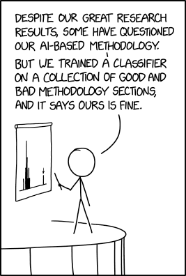
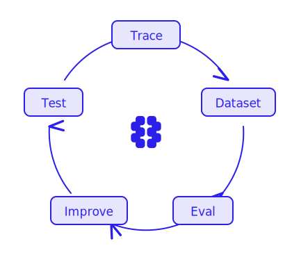
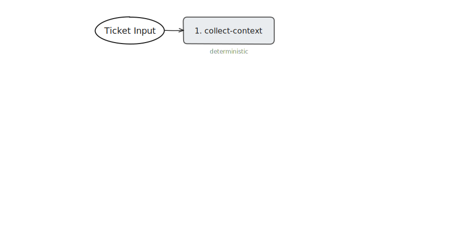
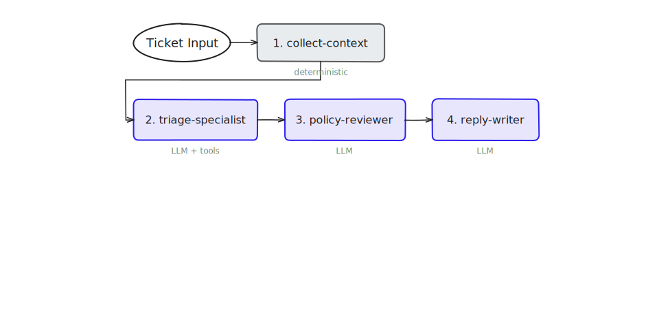
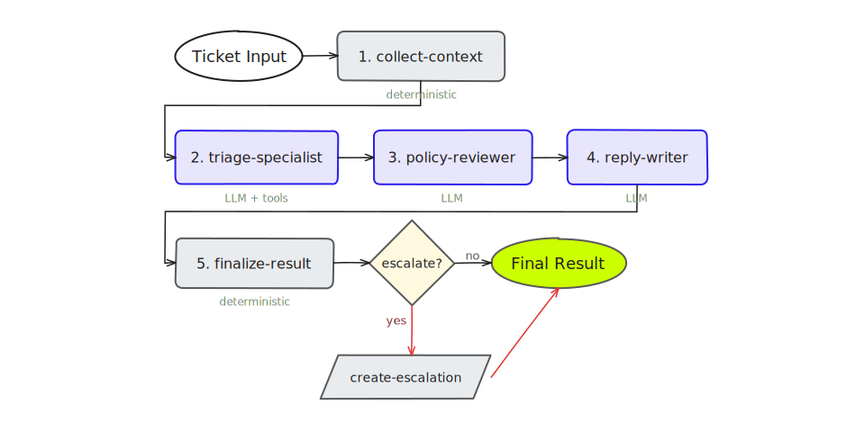
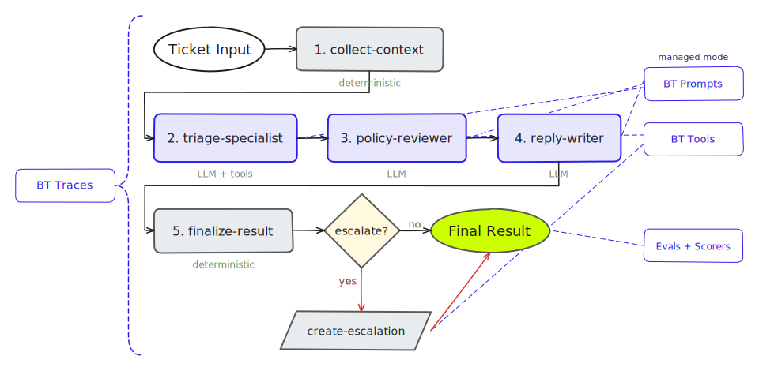

<link rel="stylesheet" href="https://cdnjs.cloudflare.com/ajax/libs/font-awesome/6.5.1/css/all.min.css">

<!-- _class: lead -->

# Shipping quality AI applications with Braintrust

## Hands-on workshop

<span style="font-size:16px;color:rgba(255,255,255,0.5)">v{{VERSION}}</span>

<!--
Speaker notes: Welcome everyone. Over the next ~110 minutes we are going to build
a support triage agent from scratch, then instrument it with tracing, evals,
managed prompts, and an edge-case remediation loop. By the end you will
have a working reference app and a repeatable mental model for shipping AI
features with assurance.
-->

---

## Agenda

<div style="display:flex;flex-direction:column;justify-content:center;flex:1">
<table style="width:100%;border-collapse:collapse;font-size:21px">
<tr style="border-bottom:2px solid #ddd">
<th style="text-align:left;padding:8px 12px;width:140px">Section</th>
<th style="text-align:left;padding:8px 12px;width:220px;white-space:nowrap">Part</th>
<th style="text-align:left;padding:8px 12px">Focus</th>
<th style="text-align:right;padding:8px 12px;width:90px;white-space:nowrap">Time</th>
</tr>
<tr style="border-bottom:2px solid var(--bt-indigo)">
<td style="padding:10px 12px;font-weight:700;color:var(--bt-indigo);vertical-align:middle">Background</td>
<td style="padding:10px 12px"></td>
<td style="padding:10px 12px">The production gap, common mistakes, what you will learn</td>
<td style="padding:10px 12px;text-align:right">~10 min</td>
</tr>
<tr style="border-bottom:1px solid #eee">
<td rowspan="6" style="padding:10px 12px;font-weight:700;color:var(--bt-indigo);vertical-align:middle">Workshop</td>
<td style="padding:10px 12px">0. Setup</td>
<td style="padding:10px 12px">Environment, agent intro, architecture walkthrough</td>
<td style="padding:10px 12px;text-align:right">~10 min</td>
</tr>
<tr style="border-bottom:1px solid #eee">
<td style="padding:10px 12px">1. Build the Agent</td>
<td style="padding:10px 12px">Scaffold → tools → 5-stage agent workflow</td>
<td style="padding:10px 12px;text-align:right">~20 min</td>
</tr>
<tr style="border-bottom:1px solid #eee">
<td style="padding:10px 12px">2. Observe</td>
<td style="padding:10px 12px">Add Braintrust tracing</td>
<td style="padding:10px 12px;text-align:right">~10 min</td>
</tr>
<tr style="border-bottom:1px solid #eee">
<td style="padding:10px 12px">3. Evaluate</td>
<td style="padding:10px 12px">Dataset, scorers, offline evals</td>
<td style="padding:10px 12px;text-align:right">~15 min</td>
</tr>
<tr style="border-bottom:1px solid #eee">
<td style="padding:10px 12px">4. Deploy & Manage</td>
<td style="padding:10px 12px">Managed prompts, tools, online scoring</td>
<td style="padding:10px 12px;text-align:right">~25 min</td>
</tr>
<tr style="border-bottom:2px solid var(--bt-indigo)">
<td style="padding:10px 12px">5. Remediate</td>
<td style="padding:10px 12px">Edge case → fix → regression test</td>
<td style="padding:10px 12px;text-align:right">~15 min</td>
</tr>
<tr>
<td style="padding:10px 12px;font-weight:700;color:var(--bt-indigo);vertical-align:middle">Wrap up</td>
<td style="padding:10px 12px"></td>
<td style="padding:10px 12px">Summary, key takeaways, next steps, Q&A</td>
<td style="padding:10px 12px;text-align:right">~15 min</td>
</tr>
</table>
</div>

<!--
Speaker notes: This is the running order. We will alternate between slides
and live coding. Each part builds on the previous one. The total is around
110 minutes with natural break points between parts.
-->

---

## Who this workshop is for

<div style="display:flex;flex-direction:column;justify-content:center;flex:1">
<div style="display:grid;grid-template-columns:1fr 1fr;gap:16px">

<div style="background:#fff;border:1px solid var(--bt-bg-alt);border-top:3px solid var(--bt-indigo);border-radius:6px;padding:18px 20px">
<div style="font-family:'Geist Mono',monospace;font-weight:600;font-size:13px;color:var(--bt-teal);margin-bottom:6px"><i class="fa-solid fa-code" style="margin-right:4px"></i> ENGINEER</div>
<div style="font-weight:600;font-size:22px;margin-bottom:4px">AI / product engineers</div>
<div style="font-size:18px;color:var(--bt-gray)">Building LLM-powered features and shipping them to production</div>
</div>

<div style="background:#fff;border:1px solid var(--bt-bg-alt);border-top:3px solid var(--bt-indigo);border-radius:6px;padding:18px 20px">
<div style="font-family:'Geist Mono',monospace;font-weight:600;font-size:13px;color:var(--bt-teal);margin-bottom:6px"><i class="fa-solid fa-rocket" style="margin-right:4px"></i> APPLIED AI</div>
<div style="font-weight:600;font-size:22px;margin-bottom:4px">Applied AI teams</div>
<div style="font-size:18px;color:var(--bt-gray)">Moving prototypes to production with repeatable quality</div>
</div>

<div style="background:#fff;border:1px solid var(--bt-bg-alt);border-top:3px solid var(--bt-indigo);border-radius:6px;padding:18px 20px">
<div style="font-family:'Geist Mono',monospace;font-weight:600;font-size:13px;color:var(--bt-teal);margin-bottom:6px"><i class="fa-solid fa-server" style="margin-right:4px"></i> PLATFORM</div>
<div style="font-weight:600;font-size:22px;margin-bottom:4px">Platform / infra teams</div>
<div style="font-size:18px;color:var(--bt-gray)">Supporting LLM applications at scale across the org</div>
</div>

<div style="background:#fff;border:1px solid var(--bt-bg-alt);border-top:3px solid var(--bt-indigo);border-radius:6px;padding:18px 20px">
<div style="font-family:'Geist Mono',monospace;font-weight:600;font-size:13px;color:var(--bt-teal);margin-bottom:6px"><i class="fa-solid fa-compass" style="margin-right:4px"></i> LEADERSHIP</div>
<div style="font-weight:600;font-size:22px;margin-bottom:4px">Technical product leaders</div>
<div style="font-size:18px;color:var(--bt-gray)">Responsible for AI reliability and production quality</div>
</div>

</div>

<div style="text-align:center;color:var(--bt-gray);font-style:italic;margin-top:12px;font-size:20px">Especially useful if you already have a prototype and need to make it trustworthy.</div>
</div>

<!--
Speaker notes: Quick self-orientation. Most people in the room will
fall into one of these categories. The techniques apply whether you
are building agents, RAG systems, or any LLM-powered workflow.
-->

---

<!-- _class: divider -->

# Background

## Why AI teams struggle to get to production

<!--
Speaker notes: Before we get hands-on, let's look at the landscape.
Why do so many AI projects stall between prototype and production,
and what does that mean for how we build?
-->

---

## The GenAI production gap

<div style="display:flex;gap:24px;align-items:center">
<div style="flex:1">

<div style="display:flex;flex-direction:column;gap:18px;margin-top:4px">
<div style="display:flex;align-items:center;gap:20px;padding:16px 20px;background:#fff;border-left:4px solid var(--bt-indigo);border-radius:0 6px 6px 0">
<span style="font-size:52px;font-weight:700;color:var(--bt-indigo);font-family:'Geist Mono',monospace;line-height:1">95%</span>
<span style="font-size:22px;line-height:1.3">of GenAI pilots fail to scale beyond proof-of-concept <span style="font-size:15px;color:var(--bt-gray)">— <a href="https://fortune.com/2025/08/18/mit-report-95-percent-generative-ai-pilots-at-companies-failing-cfo/">MIT/NANDA 2025</a></span></span>
</div>
<div style="display:flex;align-items:center;gap:20px;padding:16px 20px;background:#fff;border-left:4px solid var(--bt-indigo);border-radius:0 6px 6px 0">
<span style="font-size:52px;font-weight:700;color:var(--bt-indigo);font-family:'Geist Mono',monospace;line-height:1">80%</span>
<span style="font-size:22px;line-height:1.3">of AI projects fail to deliver business value <span style="font-size:15px;color:var(--bt-gray)">— <a href="https://www.rand.org/pubs/research_reports/RRA2680-1.html">RAND Corporation</a></span></span>
</div>
<div style="display:flex;align-items:center;gap:20px;padding:16px 20px;background:#fff;border-left:4px solid var(--bt-orange);border-radius:0 6px 6px 0">
<span style="font-size:52px;font-weight:700;color:var(--bt-orange);font-family:'Geist Mono',monospace;line-height:1">89%</span>
<span style="font-size:22px;line-height:1.3">of scaling failures trace to five gaps — top three: integration complexity, <strong>output quality at volume</strong>, and <strong>monitoring & observability</strong> <span style="font-size:15px;color:var(--bt-gray)">— <a href="https://www.digitalapplied.com/blog/ai-agent-scaling-gap-march-2026-pilot-to-production">Digital Applied 2026</a></span></span>
</div>
</div>

<div style="margin-top:18px;padding:14px 20px;background:var(--bt-indigo);color:#fff;border-radius:6px;font-size:21px;font-weight:600">
The bottleneck is the operational skill set: evaluation, observability, and systematic improvement.
</div>

</div>
<div style="flex:0 0 auto;text-align:center;margin-top:40px">



<span style="font-size:11px;color:var(--bt-gray);display:block;margin-top:-8px">xkcd.com/2451 (CC BY-NC 2.5)</span>

</div>
</div>

<!--
Speaker notes: These are not small-sample anecdotes. MIT surveyed 350+
employees and analysed 300 public deployments. The Digital Applied survey
of 650 enterprise tech leaders found that the teams who successfully scale
invest more in evaluation infrastructure and monitoring than in model
selection. This workshop teaches that operational skill set.
-->

---

## Common mistakes teams make when shipping AI

<div style="display:grid;grid-template-columns:1fr 1fr;gap:12px;margin-top:8px">
<div style="background:#fff;border-left:4px solid var(--bt-orange);padding:10px 16px;border-radius:6px;line-height:1.25">
<strong style="font-size:21px"><i class="fa-solid fa-play" style="color:var(--bt-orange);margin-right:6px;font-size:16px"></i>Demo-driven shipping</strong><br>
<span style="font-size:17px;color:var(--bt-gray)">Launching after 3-5 impressive demos without systematic testing</span>
</div>
<div style="background:#fff;border-left:4px solid var(--bt-orange);padding:10px 16px;border-radius:6px;line-height:1.25">
<strong style="font-size:21px"><i class="fa-solid fa-cube" style="color:var(--bt-orange);margin-right:6px;font-size:16px"></i>Monolithic prompts</strong><br>
<span style="font-size:17px;color:var(--bt-gray)">One giant prompt handling classification, policy, and response</span>
</div>
<div style="background:#fff;border-left:4px solid var(--bt-orange);padding:10px 16px;border-radius:6px;line-height:1.25">
<strong style="font-size:21px"><i class="fa-solid fa-scroll" style="color:var(--bt-orange);margin-right:6px;font-size:16px"></i>Logs as observability</strong><br>
<span style="font-size:17px;color:var(--bt-gray)">Treating raw logs as sufficient insight into model behavior</span>
</div>
<div style="background:#fff;border-left:4px solid var(--bt-orange);padding:10px 16px;border-radius:6px;line-height:1.25">
<strong style="font-size:21px"><i class="fa-solid fa-band-aid" style="color:var(--bt-orange);margin-right:6px;font-size:16px"></i>Fix without coverage</strong><br>
<span style="font-size:17px;color:var(--bt-gray)">Patching failures without adding eval cases to prevent regression</span>
</div>
<div style="background:#fff;border-left:4px solid var(--bt-orange);padding:10px 16px;border-radius:6px;line-height:1.25">
<strong style="font-size:21px"><i class="fa-solid fa-eye-slash" style="color:var(--bt-orange);margin-right:6px;font-size:16px"></i>Blind LLM judging</strong><br>
<span style="font-size:17px;color:var(--bt-gray)">Running LLM judges on everything without a cost strategy</span>
</div>
</div>

<div class="teaching-point">
<strong>Key takeaway:</strong> Most production issues trace back to workflow gaps.
</div>

<!--
Speaker notes: This is deliberately opinionated. These are patterns
we see repeatedly across teams. The workshop is designed to address
each of these directly.
-->

---

## The hard part is not the prototype

<div style="display:flex;flex-direction:column;justify-content:center;flex:1;margin-top:-10px;padding-bottom:80px">
<div style="display:grid;grid-template-columns:1fr auto 1fr auto 1fr auto 1fr;align-items:stretch;gap:0 10px">
<div style="background:rgba(255,128,0,0.12);padding:20px 16px;border-radius:6px;line-height:1.3;text-align:center;display:flex;flex-direction:column;align-items:center;justify-content:flex-start">
<div style="font-size:36px;color:var(--bt-orange);margin-bottom:6px"><i class="fa-solid fa-play"></i></div>
<span style="font-size:20px;color:var(--bt-gray)">Getting a demo to work</span>
</div>
<span style="font-size:32px;color:var(--bt-orange);display:flex;align-items:center"><i class="fa-solid fa-arrow-right"></i></span>
<div style="background:rgba(255,128,0,0.25);padding:20px 16px;border-radius:6px;line-height:1.3;text-align:center;display:flex;flex-direction:column;align-items:center;justify-content:flex-start">
<div style="font-size:36px;color:var(--bt-orange);margin-bottom:6px"><i class="fa-solid fa-circle-check"></i></div>
<span style="font-size:20px;color:var(--bt-gray)">Knowing whether it is reliable</span>
</div>
<span style="font-size:32px;color:var(--bt-orange);display:flex;align-items:center"><i class="fa-solid fa-arrow-right"></i></span>
<div style="background:rgba(255,128,0,0.45);padding:20px 16px;border-radius:6px;line-height:1.3;text-align:center;display:flex;flex-direction:column;align-items:center;justify-content:flex-start">
<div style="font-size:36px;color:var(--bt-orange);margin-bottom:6px"><i class="fa-solid fa-magnifying-glass-chart"></i></div>
<span style="font-size:20px">Knowing what changed when quality drops</span>
</div>
<span style="font-size:32px;color:var(--bt-orange);display:flex;align-items:center"><i class="fa-solid fa-arrow-right"></i></span>
<div style="background:var(--bt-orange);padding:20px 16px;border-radius:6px;line-height:1.3;text-align:center;display:flex;flex-direction:column;align-items:center;justify-content:flex-start">
<div style="font-size:36px;color:#fff;margin-bottom:6px"><i class="fa-solid fa-arrows-rotate"></i></div>
<span style="font-size:20px;color:#fff">Improving it systematically</span>
</div>
</div>
<div style="display:grid;grid-template-columns:1fr auto 1fr auto 1fr auto 1fr;gap:0 10px;margin-top:6px;text-align:center">
<strong style="font-size:24px">Straightforward</strong>
<span></span>
<strong style="font-size:24px">Hard</strong>
<span></span>
<strong style="font-size:24px">Harder</strong>
<span></span>
<strong style="font-size:24px;color:var(--bt-orange)">The actual job</strong>

<div style="background:var(--bt-indigo);color:#fff;padding:18px 28px;border-radius:8px;font-size:28px;font-weight:bold;text-align:center;position:absolute;bottom:60px;left:40px;right:40px">
The feedback loop we build today is what lets an AI feature survive production.
</div>

<!--
Speaker notes: Frame the workshop. Most teams stop at the prototype.
A working demo is not evidence of reliability. This workshop covers
everything after that first demo moment - tracing, evaluation,
managed deployment, and edge-case remediation.
-->

---

## What changes between a demo and a production AI system?

| Demo / prototype | Production AI system |
|---|---|
| One prompt that seems to work | Explicit workflow with clear responsibilities |
| Judged on a few hand-picked examples | Measured on representative datasets |
| Failures are anecdotal | Failures are captured and replayed |
| Prompt changes are ad hoc | Changes are managed and evaluated |
| Little visibility into behavior | Traces show the full execution path |
| Fixes are one-off patches | Fixes become regression tests |

This workshop is about **crossing that gap deliberately**.

<!--
Speaker notes: This table is the conceptual backbone of the workshop.
Every row maps to a specific section we will build together.
-->

---

## What you will learn

<div style="display:flex;flex-direction:column;gap:0;margin-top:4px">
<div style="display:flex;align-items:center;gap:14px;padding:12px 0;border-bottom:1px solid #ddd">
<i class="fa-solid fa-robot" style="font-size:22px;color:var(--bt-teal)"></i>
<span style="font-size:21px">Build a <strong>tool-using agent</strong> and refactor it into a staged AI workflow</span>
</div>
<div style="display:flex;align-items:center;gap:14px;padding:12px 0;border-bottom:1px solid #ddd">
<i class="fa-solid fa-magnifying-glass" style="font-size:22px;color:var(--bt-teal)"></i>
<span style="font-size:21px">Instrument it with <strong>Braintrust tracing</strong> for full execution visibility</span>
</div>
<div style="display:flex;align-items:center;gap:14px;padding:12px 0;border-bottom:1px solid #ddd">
<i class="fa-solid fa-database" style="font-size:22px;color:var(--bt-teal)"></i>
<span style="font-size:21px">Create an <strong>eval dataset</strong> with representative cases and scorers</span>
</div>
<div style="display:flex;align-items:center;gap:14px;padding:12px 0;border-bottom:1px solid #ddd">
<i class="fa-solid fa-cube" style="font-size:22px;color:var(--bt-teal)"></i>
<span style="font-size:21px">Move prompts and tools into <strong>Braintrust managed objects</strong></span>
</div>
<div style="display:flex;align-items:center;gap:14px;padding:12px 0;border-bottom:1px solid #ddd">
<i class="fa-solid fa-bug" style="font-size:22px;color:var(--bt-teal)"></i>
<span style="font-size:21px">Inspect failed traces and <strong>isolate which stage broke</strong></span>
</div>
<div style="display:flex;align-items:center;gap:14px;padding:12px 0">
<i class="fa-solid fa-flask-vial" style="font-size:22px;color:var(--bt-teal)"></i>
<span style="font-size:21px">Turn <strong>edge cases</strong> into <strong>regression tests</strong> that build assurance over time</span>
</div>
</div>

<div style="background:var(--bt-indigo);color:#fff;padding:14px 24px;border-radius:8px;font-size:20px;font-weight:600;text-align:center;position:absolute;bottom:60px;left:40px;right:40px">
You will leave with a repeatable workflow for building assurance into your AI systems — observe each stage, measure what matters, improve systematically.
</div>

<!--
Speaker notes: These are the concrete skills. The tools matter, but the
mental model is what you take with you: observe, measure, improve, test.
-->

---

## Why Braintrust?

Braintrust is the infrastructure that makes AI measurable and improvable.  
It sits between your application and your models - where data, observability, and evals come together so you can ship with confidence.

<div style="display:grid;grid-template-columns:1fr 1fr 1fr;gap:14px;margin-top:12px">

<div style="background:#fff;border:1px solid var(--bt-bg-alt);border-left:3px solid var(--bt-indigo);border-radius:4px;padding:14px 16px">
<div style="font-weight:600;font-size:20px;margin-bottom:4px"><i class="fa-solid fa-database" style="color:var(--bt-indigo);margin-right:6px;font-size:16px"></i>Data</div>
<div style="font-size:16px;color:var(--bt-gray)">Turning traces and outputs into structured evaluation datasets</div>
</div>

<div style="background:#fff;border:1px solid var(--bt-bg-alt);border-left:3px solid var(--bt-indigo);border-radius:4px;padding:14px 16px">
<div style="font-weight:600;font-size:20px;margin-bottom:4px"><i class="fa-solid fa-eye" style="color:var(--bt-indigo);margin-right:6px;font-size:16px"></i>Observability</div>
<div style="font-size:16px;color:var(--bt-gray)">Understanding model behavior in production</div>
</div>

<div style="background:#fff;border:1px solid var(--bt-bg-alt);border-left:3px solid var(--bt-indigo);border-radius:4px;padding:14px 16px">
<div style="font-weight:600;font-size:20px;margin-bottom:4px"><i class="fa-solid fa-clipboard-check" style="color:var(--bt-indigo);margin-right:6px;font-size:16px"></i>Evals</div>
<div style="font-size:16px;color:var(--bt-gray)">Defining what "good" means and measuring against it</div>
</div>

<div style="background:#fff;border:1px solid var(--bt-bg-alt);border-left:3px solid var(--bt-indigo);border-radius:4px;padding:14px 16px">
<div style="font-weight:600;font-size:20px;margin-bottom:4px"><i class="fa-solid fa-arrows-rotate" style="color:var(--bt-indigo);margin-right:6px;font-size:16px"></i>Iteration</div>
<div style="font-size:16px;color:var(--bt-gray)">Comparing prompts, models, and versions to improve quality</div>
</div>

<div style="background:#fff;border:1px solid var(--bt-bg-alt);border-left:3px solid var(--bt-indigo);border-radius:4px;padding:14px 16px">
<div style="font-weight:600;font-size:20px;margin-bottom:4px"><i class="fa-solid fa-shield-halved" style="color:var(--bt-indigo);margin-right:6px;font-size:16px"></i>Quality gates</div>
<div style="font-size:16px;color:var(--bt-gray)">Automated checks that prevent regressions from reaching production</div>
</div>

<div style="background:#fff;border:1px solid var(--bt-bg-alt);border-left:3px solid var(--bt-indigo);border-radius:4px;padding:14px 16px">
<div style="font-weight:600;font-size:20px;margin-bottom:4px"><i class="fa-solid fa-bolt" style="color:var(--bt-indigo);margin-right:6px;font-size:16px"></i>Workflow acceleration</div>
<div style="font-size:16px;color:var(--bt-gray)">AI-powered tools that speed up the entire development cycle</div>
</div>

</div>

<div style="text-align:center;color:var(--bt-gray);font-size:17px;margin-top:12px">Teams at Notion, Stripe, Zapier, Vercel, and Ramp use Braintrust to ship quality AI products at scale.</div>

<!--
Speaker notes: Make the Braintrust value prop explicit. This is not
a generic observability tool - it is a complete quality platform
that covers the full lifecycle from tracing to evaluation to managed
deployment.
-->

---

## The Braintrust flywheel

<div style="display:flex;gap:30px;align-items:center;flex:1">
<div style="flex:0 0 auto;display:flex;align-items:center;justify-content:center">



</div>
<div style="flex:1;font-size:22px">

<i class="fa-solid fa-binoculars" style="color:var(--bt-indigo);width:24px;font-size:16px"></i> **Trace** → see what happened in production

<i class="fa-solid fa-folder-open" style="color:var(--bt-indigo);width:24px;font-size:16px"></i> **Dataset** → capture cases (seed + real-world edge cases)

<i class="fa-solid fa-chart-column" style="color:var(--bt-indigo);width:24px;font-size:16px"></i> **Eval** → measure quality systematically

<i class="fa-solid fa-wrench" style="color:var(--bt-indigo);width:24px;font-size:16px"></i> **Improve** → fix prompts, logic, tools

<i class="fa-solid fa-check-double" style="color:var(--bt-indigo);width:24px;font-size:16px"></i> **Test** → confirm the fix, check for regressions

</div>
</div>

<div class="teaching-point">
<strong>Key takeaway:</strong> This is a continuous loop that compounds with every cycle.
</div>

<!--
Speaker notes: This is the core mental model. Every production failure
becomes a dataset row. Every prompt change gets evaluated. The flywheel
compounds -- the more you use it, the more coverage you have.
-->

---

<!-- _class: divider -->

# Part 0: Setup

## Environment, agent intro, and architecture

<!--
Speaker notes: Before we start building, let's make sure everyone is set up
and walk through the agent we will be building and its architecture.
-->

---

## Getting started

**Environment:** macOS, Linux, or WSL on Windows

**Accounts & API keys:**
- [Braintrust](https://www.braintrust.dev/signup) - Sign-up for free
- [OpenAI Platform API key](https://platform.openai.com/api-keys)
- *Optional:* AI coding assistant (Claude Code, Codex, Cursor, Copilot, etc)

**Tooling:** `mise` + `make` (recommended), or **Node.js v22** + **pnpm v10.28.2**

**Workshop repo:** Scan or clone:

```sh
git clone https://github.com/giranm/shipping-quality-ai-applications-workshop.git
```

<div style="text-align:center">


</div>

<!--
Speaker notes: Let's get set up first. Scan the QR code or clone the repo now.
The README has full instructions. mise trust && mise install && make setup gets
you from zero to running. If you prefer not to use mise, Node 22 and pnpm
are the only hard requirements. Get this running while we cover the intro.
-->

---

## Helpr: Support triage agent

Helpr is a **fictional** support triage agent built for this workshop.
It is designed to teach production AI patterns - not as a production-ready application.

Given a support ticket, it produces:

| Field | Example |
|-------|---------|
| `category` | `billing` |
| `severity` | `high` |
| `should_escalate` | `true` |
| `escalation_reason` | Finance workflow blocked for enterprise customer |
| `recommended_action` | Check plan migration and export permissions |
| `customer_reply` | "Thanks for reporting this. I can see..." |
| `confidence` | `0.86` |

<!--
Speaker notes: Helpr is purely educational -- it exists to give us a
realistic enough domain to demonstrate production AI patterns without
requiring specialised knowledge. Support triage is relatable: everyone
has filed a ticket. The structured output covers classification,
escalation logic, customer-facing text, and a confidence score -- just
enough complexity to exercise tracing, evals, managed prompts, and
remediation. Emphasise that nobody should ship this as-is; the value
is the workflow, not the app.
-->

---

## The 5-stage agent workflow

<div style="flex:1;display:flex;align-items:center;justify-content:center;margin:0 -50px">



</div>

<!--
Speaker notes: We start with a deterministic entry point. The ticket
comes in and collect-context gathers evidence -- help centre articles,
recent account events. No LLM involved yet, just data assembly.
-->

---

## The 5-stage agent workflow

<div style="flex:1;display:flex;align-items:center;justify-content:center;margin:0 -50px">



</div>

<!--
Speaker notes: Now the LLM stages. Triage-specialist classifies and
routes. Policy-reviewer catches over-reaction and under-reaction.
Reply-writer drafts the customer response. Three separate prompts,
each with a single responsibility -- much easier to debug than a monolith.
-->

---

## The 5-stage agent workflow

<div style="flex:1;display:flex;align-items:center;justify-content:center;margin:0 -50px">



</div>

<!--
Speaker notes: The deterministic exit. Finalize-result assembles the
structured output. The escalation decision is a code check, not an LLM
guess. If escalation is needed, it is a deterministic side effect.
Deterministic bookends keep the business contract stable.
-->

---

## The 5-stage agent workflow

<div style="flex:1;display:flex;align-items:center;justify-content:center;margin:0 -50px">



</div>

<!--
Speaker notes: Finally, Braintrust wraps the whole thing. Traces give
full execution visibility. Prompts and Tools are managed centrally so
you can update without redeploying. Evals and online scorers measure
quality continuously. This is the complete production-ready architecture.
-->

---

## Checkpoint map

<div style="font-size:24px;line-height:1.3">

| # | git checkout workshop/... | Focus |
|---|---------------------------|-------|
| 00 | `00-starter` | Scaffold & environment setup |
| 01 | `01-basic-agent` | Single LLM call + structured output |
| 02 | `02-add-local-tools` | Deterministic tools |
| 03 | `03-specialist-stages` | 5-stage agent workflow |
| 04 | `04-add-tracing` | Braintrust observability |
| 05 | `05-add-dataset-and-evals` | Offline evaluation + scorers |
| 06 | `06-managed-prompts-and-parameters` | Braintrust prompt management |
| 07 | `07-managed-tools` | Braintrust tool management |
| 08 | `08-online-scoring` | Live quality signals |
| 09a | `09a-prod-failure` | Replay production failure |
| 09b | `09b-remediation` | Fix + regression test |
| 10 | `10-final` | Polish & review |

</div>

Each checkpoint is a **runnable state** of the app. Fall behind? Check out the next branch.

<!--
Speaker notes: Each checkpoint is a git branch under workshop/. If you fall behind
at any point, checkout the next branch and catch up immediately. Phase 09 has two
sub-checkpoints: 09a replays the failure, 09b applies the fix and runs regression
evals. The terminal commands will be on screen when we reach each phase.
-->

---

<!-- _class: divider -->

# Part 1: Build the agent

## Checkpoints 00 → 03

<!--
Speaker notes: Let's start by building the agent itself. We will go
from an empty scaffold to a full 5-stage agent workflow.
-->

---

## Checkpoint 00: Scaffold → 01 basic agent

**Goal:** Get a plausible result from a single LLM call

- One prompt, one model call, structured output via Zod schema
- No tools, no stages, no tracing
- This is where many teams stop

<div class="teaching-point">
<strong>Key takeaway:</strong> A working demo is not evidence of reliability.
</div>

<!--
Speaker notes: We start with a system prompt and structured output.
The result will look reasonable. That is exactly the trap -- it looks
good on one example, but we have no idea if it is reliable across
the range of real tickets.
-->

---

## Pseudocode: Basic agent

```ts
async function runSupportTriage(input: TicketInput): Promise<TriageResult> {
  const response = await client.responses.parse({
    model,
    instructions: buildTriageSpecialistSystemPrompt(),
    input: [{ role: "user", content: formatTicketMessage(input) }],
    text: { format: zodTextFormat(triageResultSchema, "triage_result") },
  });

  return response.output_parsed;
}
```

One function. One model call. Structured output from day one.

<!--
Speaker notes: This is the entire agent at checkpoint 01. Notice
the Zod schema -- we get typed structured output immediately.
Simple, but we have no visibility into why it made its decisions.
-->

---

## Try it: Submit a ticket

<div style="display:flex;gap:30px">
<div style="flex:1">

**Run pre-built tickets:**

```sh
make demo
```

**Or submit your own interactively:**

```sh
make ticket
```

Type your ticket description, then press **Enter** through the follow-up prompts - customer tier, product area, and account ID are **auto-inferred** from your text and default automatically.

</div>
<div style="flex:1">

**Example output:**

| Field | Value |
|-------|-------|
| Category | `billing` |
| Severity | `high` |
| Escalate | `yes` |
| Confidence | `92%` |

*Plus: escalation reason, recommended actions, and a draft customer reply.*

</div>
</div>

<!--
Speaker notes: Let the room try this now. make demo runs four
pre-built tickets end-to-end. make ticket is interactive - type a
ticket, press Enter to accept the inferred defaults for customer
tier, product area, and account. The output is a fully structured
TriageResult with category, severity, escalation, confidence,
reasoning, recommended actions, and a draft reply.
-->

---

## Checkpoint 02: Add local tools

**Goal:** Augment the model with deterministic context

Three local tools:

| Tool | Purpose |
|------|---------|
| `searchHelpCenter(query)` | Relevant article snippets |
| `lookupRecentAccountEvents(id)` | Recent account changes |
| `createEscalation(reason)` | Deterministic side effect |

<div class="teaching-point">
<strong>Key takeaway:</strong> <br/>
As soon as the app can call tools, the number of ways it can fail increases.
</div>

<!--
Speaker notes: Tools are deterministic and use local sample data so
the workshop stays stable. But even with deterministic tools, the model
can ignore them, misinterpret the results, or fail to act on critical
signals like a billing_admin_role_removed event.
-->

---

## Pseudocode: With tools

```ts
async function runSupportTriage(input: TicketInput): Promise<TriageResult> {
  const evidence = {
    help_center_results: searchHelpCenter(input.ticket),
    recent_account_events: lookupRecentAccountEvents(input.account_id),
  };

  const response = await client.responses.parse({
    model,
    instructions: buildTriageSpecialistSystemPrompt(),
    input: [{ role: "user", content: formatTicketWithEvidence(input, evidence) }],
    text: { format: zodTextFormat(triageResultSchema, "triage_result") },
  });

  if (response.output_parsed.should_escalate) {
    createEscalation(response.output_parsed.escalation_reason);
  }

  return response.output_parsed;
}
```

<!--
Speaker notes: We gather context before the model call and pass it
in. Escalation is a deterministic side effect. Still a monolith --
one big prompt making all decisions at once.
-->

---

## Checkpoint 03: Specialist stages

**Goal:** Replace the monolith with explicit handoffs

| Stage | Type | Responsibility |
|-------|------|---------------|
| `collect-context` | deterministic | Gather help articles + account events |
| `triage-specialist` | LLM + tools | First classification + severity judgment |
| `policy-reviewer` | LLM | Approve or override the draft |
| `reply-writer` | LLM | Draft the customer-facing reply |
| `finalize-result` | deterministic | Merge decisions + escalate if needed |

<div class="teaching-point">
<strong>Key takeaway:</strong> Explicit stages are more debuggable than opaque monoliths.
</div>

<!--
Speaker notes: This is the architectural shift. Instead of one prompt
making every decision, we have five stages with clear responsibilities.
The policy-reviewer is the safety net. Separating decision from reply
lets you improve wording and policy independently.
-->

---

## Pseudocode: Staged workflow

```ts
async function runSupportTriage(input: TicketInput): Promise<TriageResult> {
  const evidence    = await collectContext(input);
  const triage      = await runTriageSpecialist({ input, evidence, model });
  const reviewed    = await runPolicyReviewer({ input, evidence, draft: triage, model });
  const reply       = await runReplyWriter({ input, reviewedDecision: reviewed, model });

  return finalizeResult({ reviewedDecision: reviewed, reply });
}
```
Five lines. Each stage has a single responsibility.

When something goes wrong, you know exactly which stage to investigate.

<!--
Speaker notes: This is the shape that stays for the rest of the
workshop. The workflow is explicit. Each stage can be traced,
tested, and improved independently.
-->

---

<!-- _class: code-along -->

## Code along: Build the agent

Checkpoints 00 through 03

```sh
git checkout workshop/00-starter            # start here
git checkout workshop/03-specialist-stages  # catch up here
```

```sh
make setup
RUNTIME_MODE=local make demo
```

<!--
Speaker notes: Everyone should be coding now. Walk through the key
changes live. If anyone falls behind, checkout 03-specialist-stages
to catch up before we add tracing.
-->

---

<!-- _class: divider -->

# Part 2: Observe

## Checkpoint 04: Braintrust tracing

<!--
Speaker notes: The agent works. Now we need to see inside it.
Without observability, debugging is guesswork.
-->

---

## Checkpoint 04: Add Braintrust tracing

<p style="font-size:22px"><strong>Goal:</strong> Make every stage, tool call, and model call visible</p>

<div style="display:flex;flex-direction:column;gap:0;margin-top:4px">
<div style="display:flex;align-items:center;gap:14px;padding:10px 0;border-bottom:1px solid #ddd">
<span style="font-size:26px;color:var(--bt-teal);font-weight:700">&#10003;</span>
<span style="font-size:21px">Full execution path for every request</span>
</div>
<div style="display:flex;align-items:center;gap:14px;padding:10px 0;border-bottom:1px solid #ddd">
<span style="font-size:26px;color:var(--bt-teal);font-weight:700">&#10003;</span>
<span style="font-size:21px">Nested stage spans with inputs, outputs, metadata</span>
</div>
<div style="display:flex;align-items:center;gap:14px;padding:10px 0;border-bottom:1px solid #ddd">
<span style="font-size:26px;color:var(--bt-teal);font-weight:700">&#10003;</span>
<span style="font-size:21px">Model call details: latency, tokens, cost</span>
</div>
<div style="display:flex;align-items:center;gap:14px;padding:10px 0;border-bottom:1px solid #ddd">
<span style="font-size:26px;color:var(--bt-teal);font-weight:700">&#10003;</span>
<span style="font-size:21px">Tool call details: what was called, what it returned</span>
</div>
<div style="display:flex;align-items:center;gap:14px;padding:10px 0">
<span style="font-size:26px;color:var(--bt-teal);font-weight:700">&#10003;</span>
<span style="font-size:21px">Tags for filtering: <code>entrypoint</code>, <code>runtime_mode</code>, stage names</span>
</div>
</div>

<div class="teaching-point" style="position:absolute;bottom:60px;left:40px;right:40px">
<strong>Key takeaway:</strong> The final answer is not enough.<br/>
Production debugging requires the full execution path.
</div>

<!--
Speaker notes: We wrap each stage in a traced span. The root span
carries ticket metadata. Stage spans carry prompt mode and reviewer
action. After this checkpoint, run a ticket and open Braintrust to
see the trace.
-->

---

## Pseudocode: Tracing

```ts
const run = await tracedWorkflow("support-triage", input, async (rootSpan) => {
  const evidence = await withChildSpan(rootSpan, "collect-context",
    () => collectContext(input));

  const triage = await withChildSpan(rootSpan, "triage-specialist",
    () => runTriageSpecialist({ input, evidence, model }));

  const reviewed = await withChildSpan(rootSpan, "policy-reviewer",
    () => runPolicyReviewer({ input, evidence, draft: triage, model }));

  const reply = await withChildSpan(rootSpan, "reply-writer",
    () => runReplyWriter({ input, reviewedDecision: reviewed, model }));

  return withChildSpan(rootSpan, "finalize-result",
    () => finalizeResult({ reviewedDecision: reviewed, reply }));
});
```

Same workflow. Each stage now wrapped in a traced span.

<!--
Speaker notes: The structure of the code mirrors the structure of
the trace tree in Braintrust. tracedWorkflow creates the root span.
withChildSpan creates nested spans for each stage.
-->

---

## How to read a trace

```sh
root span ─── overall input, final result, cost, latency
├── collect-context ──── deterministic retrieval
├── triage-specialist ── first model judgment
├── policy-reviewer ──── approval or override
├── reply-writer ─────── customer-facing response
└── finalize-result ──── merge + escalation
```

### Interpretation guide

| What you see | What it means |
|-------------|---------------|
| `collect-context` is weak | Retrieval / tooling problem |
| Specialist weak, reviewer fixes it | Reviewer is adding value |
| Reviewer rewrites everything | Specialist prompt is weak |
| Reply drifts from reviewed decision | Reply stage prompt is weak |
| `finalize-result` is wrong | Business logic bug |

<!--
Speaker notes: This is the diagnostic framework. When something goes
wrong, the trace tells you which stage to fix. Bookmark this slide --
you will use it during the failure replay later.
-->

---

<!-- _class: code-along -->

## Code along: Add tracing

Checkpoint 04

```sh
git checkout workshop/04-add-tracing    # catch up here
```

```sh
RUNTIME_MODE=local make demo
```

Then open **Braintrust → Logs** → click the trace → expand each stage.

<!--
Speaker notes: After running make demo, open Braintrust and find
the trace. Expand each stage. Notice the model call details, the
tool calls, and the metadata. This is what observability looks like
for an AI system.
-->

---

<!-- _class: divider -->

# Part 3: Evaluate

## Checkpoint 05: Dataset & offline evals

<!--
Speaker notes: We can see inside the agent now. Next we need to
measure its quality systematically.
-->

---

## What does "good enough to ship" mean?

<p style="font-size:22px;color:var(--bt-gray);margin-bottom:4px">For our Helpr support triage app, quality means:</p>

<div style="display:flex;flex-direction:column;gap:0;margin-top:4px">
<div style="display:flex;align-items:center;gap:14px;padding:10px 0;border-bottom:1px solid #ddd">
<span style="font-size:26px;color:var(--bt-teal);font-weight:700">&#10003;</span>
<span style="font-size:21px">Correct category on common support cases</span>
</div>
<div style="display:flex;align-items:center;gap:14px;padding:10px 0;border-bottom:1px solid #ddd">
<span style="font-size:26px;color:var(--bt-teal);font-weight:700">&#10003;</span>
<span style="font-size:21px">No low-severity outcome for enterprise-blocking incidents</span>
</div>
<div style="display:flex;align-items:center;gap:14px;padding:10px 0;border-bottom:1px solid #ddd">
<span style="font-size:26px;color:var(--bt-teal);font-weight:700">&#10003;</span>
<span style="font-size:21px">Escalation decisions align with policy</span>
</div>
<div style="display:flex;align-items:center;gap:14px;padding:10px 0;border-bottom:1px solid #ddd">
<span style="font-size:26px;color:var(--bt-teal);font-weight:700">&#10003;</span>
<span style="font-size:21px">Customer reply stays faithful to the final reviewed decision</span>
</div>
<div style="display:flex;align-items:center;gap:14px;padding:10px 0;border-bottom:1px solid #ddd">
<span style="font-size:26px;color:var(--bt-teal);font-weight:700">&#10003;</span>
<span style="font-size:21px">Structured output is always valid</span>
</div>
<div style="display:flex;align-items:center;gap:14px;padding:10px 0">
<span style="font-size:26px;color:var(--bt-teal);font-weight:700">&#10003;</span>
<span style="font-size:21px">Changes improve target cases <strong>without breaking unrelated ones</strong></span>
</div>
</div>

<div style="background:var(--bt-indigo);color:#fff;padding:14px 24px;border-radius:8px;font-size:22px;font-weight:600;text-align:center;position:absolute;bottom:60px;left:40px;right:40px">
Evals are how you turn these expectations into something you can test repeatedly.
</div>

<!--
Speaker notes: Define success before introducing measurement. This
slide makes the eval section feel inevitable rather than optional.
-->

---

## Checkpoint 05: Dataset & offline evals

<div style="font-size:22px">

**Goal:** Stop evaluating by intuition - measure quality systematically

**Seed dataset** covers easy, medium, and hard cases: straightforward routing, ambiguous severity, hidden urgency behind calm wording, and conflicting tool signals.

**Two types of scorers:**
- **Deterministic (code-based)** - exact match on category, severity, escalation; schema validation; confidence range checks. Fast, cheap, run on every case.
- **LLM-as-a-Judge** - evaluates customer reply quality against a rubric (tone, accuracy, faithfulness to the reviewed decision). Catches nuance that code cannot.

```sh
make seed-dataset && RUNTIME_MODE=local make eval
```

</div>

<div class="teaching-point">
<strong>Key takeaway:</strong><br/>
The point of evals is to know whether the system is safe to change.
</div>

<!--
Speaker notes: The seed dataset has representative test cases. Deterministic
scorers are cheap and fast - run them on everything. LLM-as-a-judge scorers
catch nuance but cost more - use them strategically. After running the eval,
open Braintrust Experiments to see the score breakdown per case.
-->

---

<!-- _class: divider -->

# Part 4: Deploy & manage

## Checkpoints 06 → 08

<!--
Speaker notes: The agent works, we can see it, we can measure it.
Now we move runtime control into Braintrust so prompts, tools, and
quality signals can be managed without redeploying code.
-->

---

## Why AI teams need a shared platform?

<p style="font-size:22px;color:var(--bt-gray);margin-bottom:4px">Tracing and evals can start locally. But once multiple people are involved, the workflow needs a shared platform.</p>

<div style="display:flex;flex-direction:column;gap:0;margin-top:4px">
<div style="display:flex;align-items:center;gap:14px;padding:10px 0;border-bottom:1px solid #ddd">
<span style="font-size:26px;color:var(--bt-indigo);font-weight:700">&#10003;</span>
<span style="font-size:21px"><strong>Shared prompt management</strong> — everyone edits the same source of truth</span>
</div>
<div style="display:flex;align-items:center;gap:14px;padding:10px 0;border-bottom:1px solid #ddd">
<span style="font-size:26px;color:var(--bt-indigo);font-weight:700">&#10003;</span>
<span style="font-size:21px"><strong>Runtime configurability</strong> — change model or parameters without redeploying</span>
</div>
<div style="display:flex;align-items:center;gap:14px;padding:10px 0;border-bottom:1px solid #ddd">
<span style="font-size:26px;color:var(--bt-indigo);font-weight:700">&#10003;</span>
<span style="font-size:21px"><strong>Reproducibility</strong> — every change is versioned and auditable</span>
</div>
<div style="display:flex;align-items:center;gap:14px;padding:10px 0;border-bottom:1px solid #ddd">
<span style="font-size:26px;color:var(--bt-indigo);font-weight:700">&#10003;</span>
<span style="font-size:21px"><strong>Safer iteration</strong> — eval before you ship, not after</span>
</div>
<div style="display:flex;align-items:center;gap:14px;padding:10px 0">
<span style="font-size:26px;color:var(--bt-indigo);font-weight:700">&#10003;</span>
<span style="font-size:21px"><strong>Auditability</strong> — know who changed what and when</span>
</div>
</div>

<div style="background:var(--bt-indigo);color:#fff;padding:14px 24px;border-radius:8px;font-size:22px;font-weight:600;text-align:center;position:absolute;bottom:60px;left:40px;right:40px">
This is the point where an individual workflow becomes an organizational capability.
</div>

<!--
Speaker notes: This is the transition from "I can build and test locally"
to "my team can operate this in production." Managed mode is the mechanism.
-->

---

## Checkpoint 06 & 07: Managed prompts, parameters & tools

At this point, the technical workflow works. Now we make it **manageable by a team**.  
Move runtime control into Braintrust **without losing reproducibility**

<div style="font-size:24px;line-height:1.3">

| What moves | Where it goes |
|-----------|---------------|
| Prompt text (3 stages) | Managed prompts: `helpr-triage-specialist`, `helpr-policy-reviewer`, `helpr-reply-writer` |
| Model selection | Parameter: `helpr-runtime-config` |
| Retrieval tools | Managed tools on triage prompt |
| Escalation tool | Managed tool, app-controlled execution |

</div>

### Two runtime modes

**`local`** - prompts in code, tools in code
**`managed`** - prompts from Braintrust, tools from Braintrust, model from parameter

```sh
make setup-braintrust
RUNTIME_MODE=managed make demo
```

<!--
Speaker notes: The app structure stays the same. What changes is where
the prompts and tools come from. In managed mode, Braintrust becomes
the platform. Non-engineers can edit prompts in the UI. The
parameter object controls the runtime model.
-->

---

## Checkpoint 08: Online scoring

<div style="font-size:22px;line-height:1.4">

**Goal:** Live traces carry quality signals, not just execution details

| Offline evals | Online scoring |
|--------------|----------------|
| Known cases with expected outputs | Live traffic, no expected output |
| Run on demand | Automated on every trace |
| Dataset rows | Production spans |

**What we publish:**
- **Deterministic scorers** - schema validity, required fields, confidence range
- **LLM-as-a-Judge scorers** - triage quality, reply tone
- **Automation rules** - `helpr-root-quality-online`, `helpr-reply-quality-online`, `helpr-stage-structure-online`

After this: every trace carries structured quality signals automatically.

<div style="font-size:18px;background:rgba(255,128,0,0.08);border-left:4px solid var(--bt-orange);padding:8px 14px;border-radius:4px;margin-top:8px">
<strong>Workshop vs production:</strong> Here we run LLM-as-judge on <strong>every trace</strong> for visibility. <br/>
In production, you would <strong>sample 5–10%</strong> of traces for LLM-based scoring to manage costs; deterministic scorers can still run 100%.
</div>

</div>

<!--
Speaker notes: Online scoring bridges offline evals and production
monitoring. Not every offline scorer belongs online, but the ones
that do make your logs operationally legible. Run make demo in managed
mode and check the trace -- scores now appear next to spans. Important
callout: we score every trace here for learning purposes. In production
you would sample 5-10% for LLM-based scorers to keep costs manageable.
Deterministic scorers are cheap and can run on every trace.
-->

---

<!-- _class: divider -->

# Part 5: Remediate

## Checkpoints 09a & 09b

<!--
Speaker notes: This is the part that matters most. Everything we
built so far enables what comes next: turning a production failure
into a systematic fix.
-->

---

## Checkpoint 09a: The production failure

<div style="background:#fff0f0;border:2px solid #e03131;border-radius:8px;padding:16px 20px;margin-bottom:12px">
<span style="font-size:14px;font-weight:bold;color:#e03131;text-transform:uppercase;letter-spacing:1px">Production ticket</span>

*"Not urgent, but our CFO cannot export invoices before tomorrow's board reporting."*
</div>

- **What the model sees:** calm wording, no explicit urgency
- **What the business needs:** high severity, immediate escalation

This is the gap between prototype quality and production quality.


### Code checkpoint:
```sh
RUNTIME_MODE=managed FAILURE_MATCH="board reporting" make replay-failure
```

Then open the trace and **diagnose which stage failed**.

<!--
Speaker notes: Read the ticket carefully. "Not urgent" -- the user is
being polite. But the CFO cannot do their job before a board meeting.
The model has to infer business impact from context, not surface wording.
Use the trace reading guide to identify which stage underreacted.
-->

---

## Pseudocode: Remediation loop

<div style="font-size:24px">

```ts
// 1. Replay and observe
await replayFailure(failure);            // Inspect trace: which stage failed?

// 2. Baseline the broken case
await runEval({ scenario: "calm_wording_high_impact" });

// 3. Fix the root cause (usually policy-reviewer prompt)
await tightenReviewerPrompt();

// 4. Confirm the targeted fix
await runEval({ scenario: "calm_wording_high_impact" });

// 5. Check for regressions across all cases
await runEval({ scenario: "all" });
```

### In practice:

```sh
RUNTIME_MODE=managed EVAL_SCENARIO=calm_wording_high_impact make eval   # baseline
# ... edit prompt in Braintrust UI ...
RUNTIME_MODE=managed EVAL_SCENARIO=calm_wording_high_impact make eval   # confirm fix
RUNTIME_MODE=managed make eval                                          # full regression
```

</div>

<!--
Speaker notes: Replay, baseline, fix, confirm, regress. The failure
becomes a future regression test. The eval set grows from production
experience, not just imagination. This is the operational muscle.
-->

---

<!-- _class: code-along -->

## Code along: Failure replay & remediation

Checkpoints 09a and 09b

```sh
git checkout workshop/09a-prod-failure        # replay failures
git checkout workshop/09b-remediation         # apply fix + eval
```

```sh
RUNTIME_MODE=managed make replay-failure
RUNTIME_MODE=managed EVAL_SCENARIO=calm_wording_high_impact make eval
```

<!--
Speaker notes: This is the most important hands-on section. Take time
to inspect the trace. Identify whether the specialist underweighted
the impact or the reviewer failed to catch it. Then tighten the prompt
and rerun the eval.
-->

---

<!-- _class: divider -->

# Final remarks

<!--
Speaker notes: We have now approached the end of our session and would like to wrap up.
-->

---

## What you built today

<div class="recap-table">

| Part | What you did | Checkpoint |
|---------|-------------|------------|
| **Build** | Went from empty scaffold to a 5-stage agent workflow with structured output, tools, and specialist stages | `00` → `03` |
| **Observe** | Added Braintrust tracing so every LLM call, tool invocation, and stage is recorded | `04` |
| **Evaluate** | Created a seed dataset and ran offline evals with automated scorers | `05` |
| **Deploy** | Moved prompts, parameters, and tools into Braintrust managed mode; added online scoring | `06` → `08` |
| **Remediate** | Replayed a production failure, diagnosed it with traces, fixed the prompt, and proved the fix with a regression eval | `09a` → `09b` |

</div>

You now have the **full feedback loop**:   
build → observe → evaluate → deploy → remediate → repeat

---

## Key takeaways

<div style="display:flex;flex-direction:column;justify-content:center;flex:1">
<div style="display:grid;grid-template-columns:1fr 1fr 1fr;gap:14px">
<div style="background:#fff;border-top:4px solid var(--bt-indigo);padding:14px 16px;border-radius:6px;line-height:1.25">
<div style="display:flex;align-items:center;gap:10px;margin-bottom:6px">
<span style="font-size:28px;font-weight:700;color:var(--bt-indigo);font-family:'Geist Mono',monospace">01</span>
<span style="font-size:24px;color:var(--bt-orange)"><i class="fa-solid fa-not-equal"></i></span>
</div>
<strong style="font-size:19px">Prototype ≠ production</strong><br>
<span style="font-size:16px;color:var(--bt-gray)">A working demo is not evidence of reliability</span>
</div>
<div style="background:#fff;border-top:4px solid var(--bt-indigo);padding:14px 16px;border-radius:6px;line-height:1.25">
<div style="display:flex;align-items:center;gap:10px;margin-bottom:6px">
<span style="font-size:28px;font-weight:700;color:var(--bt-indigo);font-family:'Geist Mono',monospace">02</span>
<span style="font-size:24px;color:var(--bt-orange)"><i class="fa-solid fa-layer-group"></i></span>
</div>
<strong style="font-size:19px">Explicit stages</strong><br>
<span style="font-size:16px;color:var(--bt-gray)">Separate responsibilities make failures debuggable</span>
</div>
<div style="background:#fff;border-top:4px solid var(--bt-indigo);padding:14px 16px;border-radius:6px;line-height:1.25">
<div style="display:flex;align-items:center;gap:10px;margin-bottom:6px">
<span style="font-size:28px;font-weight:700;color:var(--bt-indigo);font-family:'Geist Mono',monospace">03</span>
<span style="font-size:24px;color:var(--bt-orange)"><i class="fa-solid fa-binoculars"></i></span>
</div>
<strong style="font-size:19px">Observability is not optional</strong><br>
<span style="font-size:16px;color:var(--bt-gray)">Traces show what happened. Evals measure what matters.</span>
</div>
</div>
<div style="display:grid;grid-template-columns:1fr 1fr;gap:14px;margin-top:14px;max-width:67%;margin-left:auto;margin-right:auto">
<div style="background:#fff;border-top:4px solid var(--bt-indigo);padding:14px 16px;border-radius:6px;line-height:1.25">
<div style="display:flex;align-items:center;gap:10px;margin-bottom:6px">
<span style="font-size:28px;font-weight:700;color:var(--bt-indigo);font-family:'Geist Mono',monospace">04</span>
<span style="font-size:24px;color:var(--bt-orange)"><i class="fa-solid fa-seedling"></i></span>
</div>
<strong style="font-size:19px">Failures are eval seeds</strong><br>
<span style="font-size:16px;color:var(--bt-gray)">Do not wait for a perfect dataset before starting</span>
</div>
<div style="background:#fff;border-top:4px solid var(--bt-indigo);padding:14px 16px;border-radius:6px;line-height:1.25">
<div style="display:flex;align-items:center;gap:10px;margin-bottom:6px">
<span style="font-size:28px;font-weight:700;color:var(--bt-indigo);font-family:'Geist Mono',monospace">05</span>
<span style="font-size:24px;color:var(--bt-orange)"><i class="fa-solid fa-infinity"></i></span>
</div>
<strong style="font-size:19px">The feedback loop compounds</strong><br>
<span style="font-size:16px;color:var(--bt-gray)">Observe → Measure → Improve → Test → Repeat</span>
</div>
</div>
</div>

<!--
Speaker notes: These five points are the workshop in summary. The
tools are important, but the mental model is what you take with you.
If you remember one thing: edge cases are not bugs to fix
and forget -- they are the seed data for building lasting assurance.
-->

---

## How to apply this with your team

<div style="position:relative;display:flex;flex-direction:column;justify-content:space-between;flex:1;padding-bottom:90px">
<div style="position:absolute;left:21px;top:28px;bottom:120px;width:2px;background:var(--bt-indigo);opacity:0.25"></div>
<div style="display:grid;grid-template-columns:44px 1fr;gap:0 16px">
<span style="font-size:28px;font-weight:700;color:var(--bt-indigo);font-family:'Geist Mono',monospace;text-align:center;line-height:1;background:var(--bt-bg);position:relative;z-index:1;padding:4px 0">1</span>
<strong style="font-size:22px;line-height:1;padding-top:6px">Pick one existing AI workflow</strong>
<span></span>
<span style="font-size:17px;color:var(--bt-gray);margin-top:2px">The one closest to production</span>
</div>
<div style="display:grid;grid-template-columns:44px 1fr;gap:0 16px">
<span style="font-size:28px;font-weight:700;color:var(--bt-indigo);font-family:'Geist Mono',monospace;text-align:center;line-height:1;background:var(--bt-bg);position:relative;z-index:1;padding:4px 0">2</span>
<strong style="font-size:22px;line-height:1;padding-top:6px">Add end-to-end tracing</strong>
<span></span>
<span style="font-size:17px;color:var(--bt-gray);margin-top:2px">See what is actually happening</span>
</div>
<div style="display:grid;grid-template-columns:44px 1fr;gap:0 16px">
<span style="font-size:28px;font-weight:700;color:var(--bt-indigo);font-family:'Geist Mono',monospace;text-align:center;line-height:1;background:var(--bt-bg);position:relative;z-index:1;padding:4px 0">3</span>
<strong style="font-size:22px;line-height:1;padding-top:6px">Collect 10-20 real edge cases</strong>
<span></span>
<span style="font-size:17px;color:var(--bt-gray);margin-top:2px">Or risky edge cases</span>
</div>
<div style="display:grid;grid-template-columns:44px 1fr;gap:0 16px">
<span style="font-size:28px;font-weight:700;color:var(--bt-indigo);font-family:'Geist Mono',monospace;text-align:center;line-height:1;background:var(--bt-bg);position:relative;z-index:1;padding:4px 0">4</span>
<strong style="font-size:22px;line-height:1;padding-top:6px">Build a small eval set</strong>
<span></span>
<span style="font-size:17px;color:var(--bt-gray);margin-top:2px">With deterministic scorers first</span>
</div>
<div style="display:grid;grid-template-columns:44px 1fr;gap:0 16px">
<span style="font-size:28px;font-weight:700;color:var(--bt-indigo);font-family:'Geist Mono',monospace;text-align:center;line-height:1;background:var(--bt-bg);position:relative;z-index:1;padding:4px 0">5</span>
<strong style="font-size:22px;line-height:1;padding-top:6px">Route every edge case back</strong>
<span></span>
<span style="font-size:17px;color:var(--bt-gray);margin-top:2px">Into the dataset</span>
</div>
</div>

<div style="background:var(--bt-indigo);color:#fff;padding:14px 24px;border-radius:8px;font-size:22px;font-weight:600;text-align:center;position:absolute;bottom:60px;left:40px;right:40px">
Start with one loop. Do not wait for a perfect platform rollout.
</div>

<!--
Speaker notes: This is the adoption recipe. It is deliberately
simple - one workflow, one eval set, one feedback loop. The goal
is to get the first cycle running, not to build the perfect system.
-->

---

## Call to action

<div style="background:var(--bt-indigo);color:#fff;padding:18px 28px;border-radius:8px;font-size:22px;font-weight:bold;text-align:center;margin-bottom:16px">
Take the feedback loop back to your team.<br>Start tracing, evaluating, and improving your AI applications today.
</div>

**Learning resources**

- [Braintrust Documentation](https://www.braintrust.dev/docs) - guides for tracing, evals, prompts, and tools
- [Braintrust Cookbook](https://www.braintrust.dev/docs/cookbook) - real-world examples and recipes
- [Workshop Repo](https://github.com/giranm/shipping-quality-ai-applications-workshop) - your reference implementation with all 11 checkpoints

**Next steps**

- Reach out to your **Braintrust account team** for onboarding support and enterprise features
- Join the [Braintrust Discord](https://discord.gg/6G8s47F44X) for Q&A and best practices

<!--
Speaker notes: Encourage attendees to take what they learned back to
their teams. The workshop repo is a working reference - they can clone
it and adapt the patterns to their own use cases. The account team can
help with enterprise setup, SSO, and advanced features like online
scoring at scale.
-->

---

<!-- _class: lead -->

# Thank you

Questions?

<!--
Speaker notes: Open the floor for questions. The repo is their
reference implementation. The README has everything needed to run
any checkpoint independently.
-->

---

<!-- _class: divider -->

# Appendix

---

## Troubleshooting & FAQ

<style scoped>section { font-size: 18px; } strong { font-size: 20px; }</style>

**Environment issues**
- `mise trust && mise install && make setup` - resets everything
- Node 22 + pnpm 10.28.2 are the only hard requirements if not using mise

**API keys**
- `BRAINTRUST_API_KEY` - from [braintrust.dev/settings](https://www.braintrust.dev/settings)
- `OPENAI_API_KEY` - from [platform.openai.com/api-keys](https://platform.openai.com/api-keys)

**Catching up**
- Every checkpoint is a `git checkout workshop/<checkpoint>` away
- Each branch is a fully runnable state - no need to complete previous steps

**Common eval pitfalls**
- Eval dataset too small → noisy scores, false confidence
- Only testing happy paths → misses the edge cases that matter
- Skipping online scoring → blind to production quality drift

---

## Useful commands reference

<div style="font-size:28px">

| Command | What it does |
|---------|-------------|
| `make setup` | Install all dependencies |
| `make demo` | Run the agent with a sample ticket |
| `make setup-braintrust` | Push prompts, tools, parameters to Braintrust |
| `RUNTIME_MODE=managed make demo` | Run in managed mode (prompts from Braintrust) |
| `make eval` | Run full eval suite |
| `EVAL_SCENARIO=X make eval` | Run a specific eval scenario |
| `make replay-failure` | Replay a production failure case |
| `make seed-dataset` | Seed the eval dataset |

</div>

